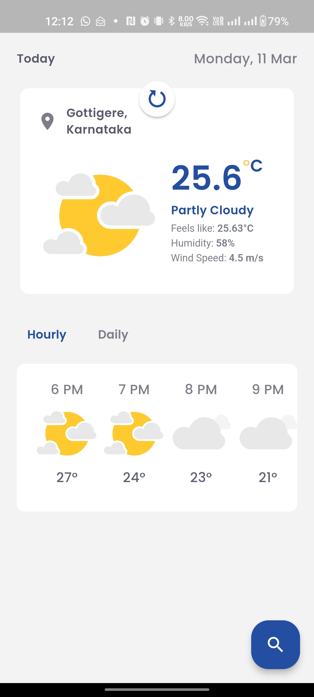

Tomorrow Weather
Tomorrow Weather is a Flutter-based weather application that uses the Tomorrow.io weather APIs to provide weather forecasts. This application is compatible with both Android and iOS platforms.

Features
Current weather conditions
Hourly and weekly forecasts
Location-based weather updates
Lottie animation

## Dependencies

This project relies on several major libraries to function properly:

- `Dio`: A powerful HTTP client for Dart, which supports Interceptors, Global configuration, FormData, Request Cancellation, File downloading, Timeout, etc.
- `Retrofit`: A type-safe HTTP client for Dart and Flutter, inspired by Retrofit for Android.
- `RxDart`: Provides additional functionality on top of the Dart Streams API for asynchronous programming.
- `Easy Localization`: Simplifies the internationalization process in Flutter.
- `Geocoding`: Provides geocoding and reverse geocoding of addresses.
- `Permission Handler`: A permissions plugin for Flutter which can manage app permissions.
- `Flutter ScreenUtil`: A Flutter plugin for adapting screen and font size, allowing your UI to display properly on different screen sizes.
- `Geolocator`: A Flutter geolocation plugin which provides easy access to platform-specific location services.
- `Fluttertoast`: A plugin to show short message notifications to the user.
- `Dartz`: A library for functional programming in Dart.
- `Flutter Bloc`: A predictable state management library that helps implement the BLoC design pattern.
- `Equatable`: A Dart package that helps to implement value-based equality without needing to explicitly override == and hashCode.
- `Get It`: A simple service locator for managing state and dependencies.

## Architecture

This project follows the principles of Clean Architecture, which is an architectural approach that separates the software into concentric layers with a strong emphasis on separation of concerns and scalability. The main components of this architecture in the project are:

- `Entities`: These are the business objects of the application.
- `Use Cases`: These are the business rules of the application. Each use case is a set of actions that can be executed.
- `Repositories`: These are interfaces that represent the data layer and are implemented in the data layer.
- `Data Sources`: These are the actual data providers, such as network requests, database access, etc.
- `Presentation Layer (Bloc)`: This is where the UI components and user interactions are handled.

The Clean Architecture allows the separation of code in a way that makes it easier to test and maintain. It also ensures that the application is not dependent on any external agency.

## Running the Project

To run this project, you need to have Flutter and Dart installed on your system. If you haven't installed them yet, you can follow the instructions on the [Flutter website](https://flutter.dev/docs/get-started/install).

Once you have Flutter and Dart set up, you can run the project using the following steps:

1. **Clone the repository**: Use the command `git clone https://github.com/vancityAyush/tomorrow_weather.git` to clone the repository to your local machine.

2. **Navigate to the project directory**: Use the command `cd tomorrow_weather` to navigate to the project directory in your terminal.

3. **Fetch the project dependencies**: Run `flutter pub get` to fetch the project dependencies.

4. **Check for any dependency issues**: Run `flutter doctor` to check for any issues with the project dependencies.

5. **Start your emulator or connect your device**: You can start your emulator through your IDE or from the command line with `flutter emulators --launch <emulator_id>`. If you want to run the app on your physical device, connect it to your computer and ensure USB debugging is enabled.

6. **Run the application**: Run `flutter run` to start the application. If you have multiple devices connected, use `flutter run -d <device_id>` to specify the device the app should run on.

7. **Build the application (Optional)**: If you want to build a release version of your app, you can run `flutter build apk` for Android or `flutter build ios` for iOS.

Please note that the application uses the Tomorrow.io API for fetching weather data, so you need to have a valid API key. You can get this key by creating an account on the [Tomorrow.io website](https://www.tomorrow.io/). Once you have the key, replace the `kApiKey` constant in the [lib/core/utils/constants.dart](lib/core/utils/constants.dart) file with your API key.

## Configuration

Before you can run the application, you need to configure the API key.

1. Open the file [lib/core/utils/constants.dart](lib/core/utils/constants.dart).
2. Locate the `kApiKey` constant.
3. Replace the `kApiKey` constant with your Tomorrow.io API key.

Please ensure that you do not commit your API key to a public repository.

## Code Generation

This project uses `build_runner` and `easy_localization` for code generation. To generate the necessary code, run the following commands:
1. For `build_runner`, run:
   ```bash
   flutter pub run build_runner watch --delete-conflicting-outputs
2. For `build_runner`, run:
   ```bash
   flutter pub run build_runner watch --delete-conflicting-outputs
   ```
3. For `easy_localization`, run:
   ```bash
   flutter pub run easy_localization:generate --source-dir ./assets/locales -f keys -O lib/gen -o locale_keys.g.dart
   ```


## Issues and Troubleshooting

### Too Many API Calls

If you encounter an issue where the application is making too many API calls to Tomorrow.io, this could be due to hitting the rate limit of your API key.

#### Solution

The solution to this issue is to create a new API key from the Tomorrow.io dashboard. Here are the steps to do so:

1. Log in to your account on the [Tomorrow.io website](https://www.tomorrow.io/).
2. Navigate to the API section.
3. Click on "Create a new API key".
4. Once the new API key is generated, replace the old API key in the [lib/core/utils/constants.dart](lib/core/utils/constants.dart) file with the new one.

Remember to manage your API calls wisely to avoid hitting the rate limit frequently.

## Screenshots




## About the Author

This project was created by [vancityAyush](https://github.com/vancityAyush). I am a passionate developer with experience in Kotlin, Java, Dart, and Gradle. I enjoy working on projects that involve complex architectures and innovative solutions. Feel free to reach out to me for any questions, suggestions, or collaboration opportunities.

## Contact Information

For any inquiries, you can reach me at:

- Email: eliasakeleven@gmail.com
- Phone: +919060842578
- LinkedIn: [Elias AK](https://www.linkedin.com/in/eliasak11/)
- GitHub: [vancityAyush](https://github.com/vancityAyush)
